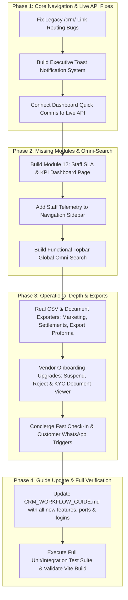

# Grand Store CRM — Feature Enhancement & Implementation Plan

> **Goal**: Upgrade the Grand Store Standalone Operations CRM from an operational prototype to an enterprise-grade command center by implementing all missing features, real API connections, interactive tools, document exporters, and updating documentation.

---

## Architecture Context & Operational Boundaries
- **CRM Frontend Directory**: `c:\office\store-new\grandstore-crm` (Vite, React, Tailwind CSS, Lucide Icons, Agentation)
- **CRM Frontend Port**: `http://localhost:5181/`
- **Backend Directory**: `c:\office\store-new\grand-store\backend` (Express, Node.js, JWT, Bcrypt)
- **Backend API Port**: `http://localhost:5015`
- **Database**: MongoDB Atlas Cluster
- **Deployment Rule**: 100% Local Development. **NO remote VPS deployments**.

---

## 4-Phase Implementation Roadmap

---

## Phase 1: Core Navigation, Route Fixes & Live Communications API

### Objective
Eliminate broken routes left over from the repository extraction, replace disruptive browser `alert()` popups with a modern executive toast system, and wire up the morning dashboard's quick comms form to persist directly into MongoDB.

### Tasks:
1. **Fix Broken Internal Routes**:
   - `src/pages/CrmCustomersPage.jsx`:
     - Line 163: Fix `onClick={() => navigate('/crm/customers/${c._id}')}` ➔ `navigate('/customers/${c._id}')`.
   - `src/pages/CrmCustomerDetailPage.jsx`:
     - Line 62: Fix `navigate('/crm/customers')` ➔ `navigate('/customers')`.
   - `src/components/dashboard/AttentionRequired.jsx`:
     - Line 76: Fix `onNavigate('/crm/orders')` ➔ `onNavigate('/orders')`.

2. **Build Executive Toast Notification System**:
   - Create `src/context/ToastContext.jsx` with animated, sleek notifications (Success, Error, Info, Warning) styled in Grand Store Executive White & Blue.
   - Wrap `src/App.jsx` with `<ToastProvider>`.
   - Replace raw browser `alert()` calls across all pages with `toast.success()` and `toast.error()`.

3. **Wire Morning Screen Quick Comms to Live Backend**:
   - In `src/pages/CrmDashboardPage.jsx`:
     - Replace simulated `alert()` with an actual `POST /api/crm/comms` call.
     - Support optional follow-up task creation linked to the communication note.
     - Auto-refresh the Morning Screen Work Queue and display an executive success toast.

---

## Phase 2: Missing Module 12 (Staff SLA Telemetry) & Topbar Omni-Search

### Objective
Surface the existing backend SLA engine (`GET /api/crm/staff/kpis`) into a dedicated executive screen and turn the static topbar search input into an interactive, real-time omni-search modal.

### Tasks:
1. **Create Staff SLA & Performance Telemetry Page (`CrmStaffKpisPage.jsx`)**:
   - Create hook `src/hooks/useCrmStaffKpis.js` fetching from `GET /api/crm/staff/kpis`.
   - Design high-density executive dashboard:
     - **Team Summary Cards**: Average SLA Compliance %, Total Tasks Assigned (30d), Completed Tasks, Overdue Count, Active Staff.
     - **SLA Benchmark Breakdown**: High Priority (≤ 2 hours), Medium (≤ 6 hours), Normal (≤ 24 hours), Logistics Exceptions (≤ 4 hours).
     - **Staff Leaderboard Table**: Agent name, role, total assigned, completed, on-time delivery %, overdue count, and rating badge (*Excellent*, *Good*, *Needs Attention*).
2. **Register Route and Add to Navigation**:
   - In `src/App.jsx`: Add `<Route path="staff-telemetry" element={<CrmStaffKpisPage />} />`.
   - In `src/components/layout/CrmLayout.jsx`: Add `Staff SLA Telemetry` with an `Activity` icon to the sidebar navigation menu.
3. **Implement Topbar Global Omni-Search**:
   - In `CrmLayout.jsx`:
     - Bind search input with debounced querying.
     - Query customers, orders, and vendors simultaneously.
     - Render a sleek floating search results dropdown with category pills (`Customer`, `Order`, `Vendor`, `Export`).
     - Support `Enter` key or click to immediately navigate to the target detail page.
     - Add `Escape` key handler to dismiss search overlay.

---

## Phase 3: Operational Depth, Document Viewer & Real Data Exporters

### Objective
Provide operational staff and accountants with real file export capabilities (CSV/PDF), vendor compliance inspection tools, door-desk check-in speed filters, and direct concierge communication triggers.

### Tasks:
1. **Real Data Exporters**:
   - **Marketing 18+ Audience Exporter** (`CrmMarketingPage.jsx`):
     - Replace `alert()` with a client-side CSV blob generator: exports columns (`Customer Name`, `Email`, `Age Verified Date`, `Consent Status`, `Tier`).
     - Triggers native browser download: `grandstore_verified_18plus_subscribers.csv`.
   - **30-Day Settlement Remittance Batch Exporter** (`CrmSettlementsPage.jsx`):
     - Add "Export Remittance Batch (CSV)" button: exports columns (`Settlement ID`, `Order #`, `Vendor Name`, `Bank Account`, `Gross Amount`, `Commission (15%)`, `Net Payable`, `Due Date`, `Status`).
   - **Export Trade Proforma Invoice Generator** (`CrmExportTradePage.jsx`):
     - Add "Print / Export Proforma" button that renders an official Grand Store Export Invoice with buyer address, Incoterms, pallet quantities, and Grand Store bank wire instructions.
2. **Vendor Onboarding Upgrades (`CrmVendorWorkflowPage.jsx`)**:
   - Add **"Suspend Vendor"** button opening an audit modal with mandatory suspension reason.
   - Add **"Reject Application"** button with customizable rejection feedback sent to applicant.
   - Add **"Inspect KYC Documents"** modal to preview submitted CIPC, ID, and Liquor License attachments with verification checkmarks.
3. **Concierge & Tasting Speed Tools**:
   - **Tasting Event Fast Door Check-In** (`CrmAuctionEventsPage.jsx`):
     - Add a real-time ticket code search bar (`TCK-...` or guest name) at the door desk.
   - **Customer 360 Direct Action Triggers** (`CrmCustomerDetailPage.jsx`):
     - Add direct WhatsApp action button (`https://wa.me/{phone}`) and Email button (`mailto:{email}`).
     - Add quick-view modal when clicking an order from the customer's history.

---

## Phase 4: Workflow Guide Synchronization & Full Verification

### Objective
Update all documentation to reflect the expanded 10-module system, accurate port 5181, login credentials, and local backend paths, followed by complete automated testing.

### Tasks:
1. **Update `c:\office\store-new\grandstore-crm\CRM_WORKFLOW_GUIDE.md`**:
   - Update all URL references from port `5180` to **`5181`**.
   - Add Section on **Authentication & Admin Credentials**:
     - `admin@grandstore.com` (Store Administrator)
     - `admin1@grandstore.com` (Admin)
     - `crmadmin@grandstore.com` (Super Admin)
     - Password: `Admin123!`
   - Add Section on **Local Backend Architecture** (Port 5015, path `c:\office\store-new\grand-store\backend`, MongoDB Atlas).
   - Add Tab 10 walkthrough: **Staff SLA Telemetry & Productivity Tracking**.
   - Add documentation for **Global Omni-Search**, **CSV/Proforma Exporters**, and **Agentation** feedback bar.
   - Add **Startup & Troubleshooting Guide** (commands to start backend and frontend).
2. **Exhaustive Verification**:
   - Run Vite production bundle build (`npm run build`).
   - Run backend test suite (`scratch/test_all_crm_endpoints_exhaustive.js`) to guarantee 100% pass rate.
   - Confirm dev server runs cleanly on `http://localhost:5181/` without console errors.
